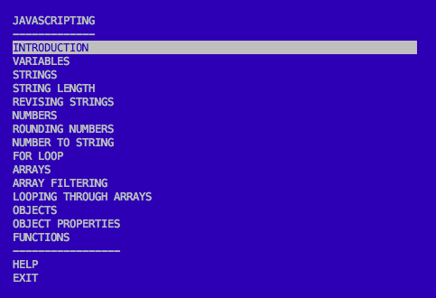
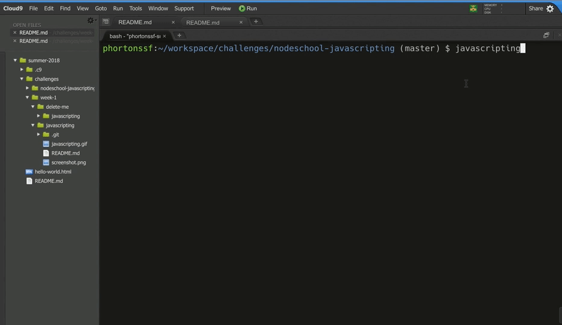

# JAVASCRIPTING

> Learn JavaScript by adventuring around in the terminal.  

> _Looking for more interactive tutorials like this? Go to [nodeschool.io](http://nodeschool.io)._

## Get help
Having issues with javascripting? Get help troubleshooting in the [nodeschool discussions repo](http://github.com/nodeschool/discussions), or on gitter:

[](https://gitter.im/nodeschool/discussions?utm_source=badge&utm_medium=badge&utm_campaign=pr-badge&utm_content=badge)

### Create Directories For Course
Run all the steps in the terminal
1. Create a folder named: **challenges** 
2. **change the directory** into challenges folder
3. Create another folder **week-1**
4. **change the directory** into week-1
5. Clone then clone this repository

Bash Commands Hint:
* **cd** change directory
* **mkdir** create new folder


### Install `javascripting` with `npm`

Open your terminal and run this command:

```
npm install --global javascripting
```

The `--global` option installs this module globally so that you can run it as a command in your terminal.

#### Having issues with installation?

If you get an `EACCESS` error, the simplest way to fix this is to rerun the command, prefixed with sudo:

```
sudo npm install --global javascripting
```

You can also fix the permissions so that you don't have to use `sudo`. Take a look at this npm documentation:
https://docs.npmjs.com/getting-started/fixing-npm-permissions

## Run the workshop

Open your terminal and run the following command:

```
javascripting
```

You'll see the menu: testing



Navigate the menu with the up & down arrow keys. 

Choose a challenge by hitting enter.

### Take a look at this gif that shows the first challenge:



Create a file when you start a challenge
Ex: challenge-1.js
We can use the command **touch** in the terminal to create a file.
```
$ touch challenge.js
```

In the gif I'm using the command line editor `nano` ([here are some basic usage tips for nano](https://github.com/sethvincent/dev-envs-book/blob/master/chapters/05-editors.md#nano)).  

You can use any editor you like. 

[atom](http://atom.io) or [brackets](http://brackets.io/) are both good options.

## Need help with an exercise?

Open an issue in the nodeschool/discussions repo: https://github.com/nodeschool/discussions

Include the name `javascripting` and the name of the challenge you're working on in the title of the issue.

## Get Involved

Code contributions welcome! Please check our [documentation on contributing](https://github.com/workshopper/javascripting/blob/master/CONTRIBUTING.md) to get started.


## License

MIT